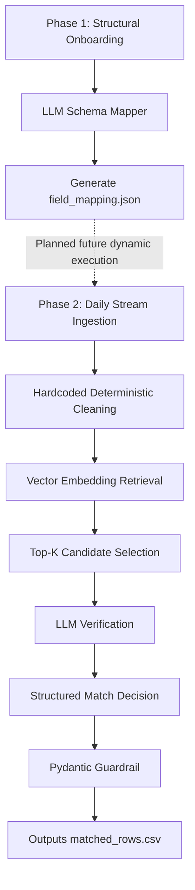

# Automated Competitor Catalog Ingestion & KVI Matching Pipeline

## What I have done:

### 1. To understand the problem and requirements: Empirical Data Analysis & Diagnostic Discovery

A rigorous audit of the source material (`source_raw.csv`) against the canonical target structures (`standard_schema.json`, `kvi_master.csv`) reveals complex structural, lexical, and programmatic anomalies. Relying purely on an LLM to resolve these issues line-by-line is computationally inefficient and economically unviable at a scale of 10 million rows per day.

Below is the diagnostic breakdown of the raw dataset:

---

#### A. Over-Aggressive Localized Corruption (The "ลิตร" Bug)

The most striking structural anomaly in the source text is an upstream script error where the character string `"L"` or `"l"` was globally search-and-replaced with the Thai word for Liter (`"ลิตร"`). This corrupted both English standard fields and promotional text across the entire text corpus:

* `"Philips ลิตรED Bulb"` → `Philips LED Bulb`
* `"BUND ลิตรE"` → `BUNDLE`
* `"Sprite ลิตรemon- ลิตรime"` → `Sprite Lemon-Lime`
* `"Nestle Pure ลิตรife Water"` → `Nestle Pure Life Water`
* `"Apple USB-C to ลิตรig."` → `Apple USB-C to Lig. (Lightning)`

---

#### B. Truncation & Abbreviation Noise

Source strings exhibit aggressive token truncation, removing characters essential for deterministic string matching:

* `"Phil."` or `"Phi."` for `Philips`
* `"Pan."` or `"Pntene"` for `Pantene`
* `"Gal."` for `Galaxy`
* `"Sprit"` for `Sprite`
* `"Detol"` or `"Antibcterial"` for `Dettol Antibacterial`

---

#### C. Multilingual & Promotional Entanglement

Product records combine Thai script, English brand names, and promotional mechanics within a single un-delimited text field:

* `"คอลเกต Colgate Toothpaste Total 100g Flash Sale -30%"`
* `"โค้ก Coca-Cola Original Taste 1.25L"`
* `"สิงห์ Singha Drinking Water 330ml SET 6 ขวด"`

(where `"ขวด"` means bottles)

---

#### D. Non-Catalog Outliers (No-Match Noise)

A significant percentage of the incoming rows represent unbranded long-tail products completely missing from the Master KVI catalog. These must be filtered or explicitly classified as `no_match` with a null target identifier:

* `"Cute cat ear hairband"`
* `"Plastic flower pot 6 inch"`
* `"Yoga mat 6mm thick blue"`
* `"Cooking apron floral pattern"`

---

#### E. Value & Price Formatting Anomalies

* **Numerical Extraction:** Prices are represented as strings containing custom suffixes (`299.-`, `29 THB`) or currency prefixes (`฿990`) alongside thousands separators enclosed in string literals (`"3,490.00"`).
* **Stock State Mappings:** The `qty_avail` column contains discrete mixed types:

  * numeric counts (`358`)
  * standard English strings (`out of stock`)
  * localized Thai expressions (`หมด`, meaning empty/out of stock)

---

## 2. Consider the processing logics: High-Performance and Efficient Pipeline

To achieve the onboarding compression target while processing large-scale catalog ingestion under strict cost ceilings, the architecture separates:

* **Phase 1:** Structural Schema Alignment (one-time processing)
* **Phase 2:** Item Matching (daily operational pipeline)



---

### Phase 1: Asynchronous Source Structural Onboarding (One-Time per Source)

Instead of running heavy inference across millions of daily records, an isolated LLM execution runs once when a new competitor source is introduced.

#### Current Implementation

1. Extract a diverse stratified sample of up to 20 records from the source dataset using evenly distributed sampling.
2. Pass:

   * sampled source records
   * canonical schema definitions (`standard_schema.json`)

   into an LLM (`gpt-4o`).
3. Generate a reusable structural mapping artifact:

   * `field_mapping.json`

This artifact documents:

* source-to-standard field mappings
* semantic reasoning
* suggested transformation logic

---

### Phase 2: High-Throughput Deterministic Streaming Pipeline

The main operational pipeline minimizes expensive LLM calls by applying deterministic filtering and vector retrieval before semantic verification.

---

#### Stage 1: Deterministic Pre-Processing & Token Repair

The pipeline first applies deterministic cleaning logic to repair corrupted strings and remove marketplace noise.

Current implemented rules include:

* reversing `"ลิตร"` corruption patterns
* removing promotional phrases:

  * `"Flash Sale"`
  * `"BUY1GET1"`
  * `"SUPER SAVE"`
* whitespace normalization

Example transformations:

* `"Philips ลิตรED Bulb"` → `"Philips LED Bulb"`
* `"Sprite ลิตรemon- ลิตรime"` → `"Sprite Lemon-Lime"`

---

#### Stage 2: Dense Vector Retrieval Filtering

The cleaned product title is converted into embeddings using:

* `text-embedding-3-small`

The system then computes cosine similarity against locally cached embeddings from the KVI master catalog.

The current implementation:

* uses local NumPy vector operations
* retrieves top candidate records (`top_k=3`)
* bypasses LLM verification if similarity falls below threshold

This significantly reduces unnecessary LLM calls for obvious `no_match` cases.

---

#### Stage 3: LLM-Based Candidate Verification

The pipeline passes:

* raw product row
* cleaned product title
* pricing context
* top retrieved candidates

into `gpt-4o-mini` for semantic verification.

The model evaluates:

* brand alignment
* model consistency
* unit compatibility
* pack size consistency
* variant mismatches

The response is constrained using strict Pydantic schema parsing.

Possible outputs:

* `match`
* `no_match`
* `uncertain`

##### Handling Low Confidence & Bad Cases

The pipeline intentionally avoids forcing uncertain matches.

Current handling logic includes:

* retrieval similarity threshold filtering
* explicit `no_match` routing
* structured `uncertain` fallback states
* exception-safe processing boundaries

Examples of low-confidence scenarios:

* corrupted titles
* ambiguous variants
* incomplete unit information
* missing catalog entries
* weak retrieval similarity

Current routing behavior:

* very low retrieval similarity
  → immediate `no_match`

* LLM uncertainty or execution failures
  → `uncertain`

* unmatched long-tail products
  → `no_match`

This design prevents overly aggressive false-positive matching and preserves operational safety.

Future production improvements would include:

* calibrated confidence thresholds
* human review queues
* confidence monitoring dashboards
* active learning feedback loops


---

## 3. Production Field Mapping Architecture (`field_mapping.json`)

The generated structural mapping configuration defines how raw source fields align to canonical schema properties.

Example:

```json
{
  "source_field": "list_price",
  "standard_field": "sellPrice",
  "reasoning": "Contains raw numerical strings contaminated with currency indicators and localized formatting.",
  "transformation_required": "CLEAN_CURRENCY_TO_FLOAT"
}
```

The mapping artifact currently serves as:

* onboarding documentation
* schema interpretation metadata
* transformation planning guidance

---

### Implementation Note 1

Due to time limitations, the current proof-of-concept implementation does **not yet utilize** the generated `field_mapping.json` during Phase 2 ingestion.

At the moment:

* Phase 1 successfully generates:

  * field mappings
  * semantic reasoning
  * suggested transformation rules

but:

* Phase 2 still relies on hardcoded preprocessing and transformation logic, due to time-limitation

The current `field_mapping.json` behaves primarily as:

* descriptive metadata
* onboarding documentation
* transformation specification artifact

rather than:

* executable ingestion logic

### Implementation Note 2

The current implementation is designed primarily as a proof-of-concept to validate:

* retrieval architecture
* semantic verification logic
* corruption handling
* structured matching workflows

To achieve true production-scale throughput (e.g. ~2 million rows/day), several additional optimizations and infrastructure layers would be required.

The key scaling principle is:

> minimize the number of rows that require expensive LLM verification.

The intended production architecture would therefore include:

* deterministic routing rules for obvious matches/non-matches
* hybrid retrieval (BM25 + embedding search)
* similarity threshold auto-accept / auto-reject logic
* asynchronous processing workers
* Batch API execution
* persistent vector databases (FAISS)
* approximate nearest neighbor (ANN) retrieval
* distributed queue-based processing
* observability and retry orchestration

The long-term production goal is for the majority of incoming rows to be resolved through:

* deterministic logic
* retrieval confidence
* threshold routing

while only a small ambiguous subset is escalated to LLM semantic verification.


---

### Intended Future Architecture

The intended production architecture is for `field_mapping.json` to become a reusable executable transformation layer.

Conceptually:

#### Phase 1

The LLM profiles the incoming competitor source and generates:

* source-to-standard mappings
* extraction rules
* transformation requirements
* normalization metadata

Example:

```json
{
  "source_field": "list_price",
  "standard_field": "sellPrice",
  "transformation_required": "CLEAN_CURRENCY_TO_FLOAT"
}
```

---

#### Planned Future Phase 2 Flow

The ingestion pipeline would then:

1. Load `field_mapping.json`
2. Dynamically resolve transformation functions
3. Apply transformation rules automatically
4. Normalize incoming records before retrieval and matching

Conceptual example:

```python
TRANSFORMATION_REGISTRY = {
    "CLEAN_CURRENCY_TO_FLOAT": clean_currency_to_float,
    "MAP_STOCK_STATE_TO_INT": map_stock_state_to_int,
    "STRIP_PROMO_AND_REPAIR_CORRUPTION": deterministic_clean_title,
}
```

The ingestion layer would dynamically execute transformations:

```python
transform_fn = TRANSFORMATION_REGISTRY[rule_name]
clean_value = transform_fn(raw_value)
```

---

## 4. Current Proof-of-Concept Scope

The current implementation demonstrates:

### Implemented Features

* deterministic preprocessing
* corruption repair
* vector embedding retrieval
* cosine similarity search
* top-k candidate pruning
* LLM verification
* structured JSON parsing via Pydantic
* local vector cache in memory
* no-match routing
* field mapping generation

---

### Current Limitations

The current implementation is intentionally lightweight and proof-of-concept focused.

The following are **not yet implemented**:

* BM25 lexical retrieval
* Reciprocal Rank Fusion (RRF)
* true hybrid search
* distributed vector databases
* async execution
* Batch API integration
* embedding persistence cache
* retry handling
* production orchestration
* observability dashboards
* regression testing
* confidence calibration
* workflow management

---

## 5. Improvements & Production Enhancements

The current implementation focuses on demonstrating the core architecture and reasoning pipeline in a compact proof-of-concept format. The following improvements are recommended to evolve the system into a scalable production-grade ingestion framework.

---

### 1. Hybrid Retrieval Layer (BM25 + Embedding Search)

The current implementation uses only dense vector retrieval via OpenAI embeddings and cosine similarity search.

A production system should introduce a hybrid retrieval architecture combining:

* dense semantic retrieval (embeddings)
* sparse lexical retrieval (BM25 keyword/token matching)

This improves robustness against:

* brand truncations
* spelling variations
* OCR noise
* multilingual corruption
* semantic drift

Example:

* `"Phil."` should still reliably retrieve `"Philips"`
* `"Pntene"` should still retrieve `"Pantene"`

A future enhancement would combine both retrieval strategies using:

* Reciprocal Rank Fusion (RRF)
* weighted hybrid scoring
* candidate reranking

This would significantly improve retrieval precision before LLM verification.

---

### 2. Configurable Retrieval Parameters

Several pipeline parameters are currently hardcoded for simplicity, including:

* candidate retrieval count (`top_k=3`)
* similarity threshold (`0.25`)
* embedding batch size (`100`)
* profiling sample size (`20`)

In production, these values should be externalized into:

* environment variables
* YAML/TOML configuration files
* centralized configuration services

This enables:

* rapid experimentation
* A/B testing
* environment-specific tuning
* operational flexibility

---

### 3. Structured Transformation Engine (as mentioned in the previous section)

The generated `field_mapping.json` currently acts as a descriptive metadata artifact.

A future enhancement would convert transformation rules into executable logic through:

* regex execution engines
* declarative transformation pipelines
* rule compilers
* validation frameworks

Example:

```json
{
  "transformation_required": "CLEAN_CURRENCY_TO_FLOAT"
}
```

could dynamically map into reusable transformation functions.

This would allow:

* reusable ingestion templates
* dynamic onboarding
* lower engineering overhead for new competitor sources

---

### 4. Evaluation Metrics & Benchmarking

The current implementation does not yet include formal evaluation metrics.

A production-grade pipeline should introduce:

* precision / recall measurement
* F1 scoring
* false-positive analysis
* confidence calibration monitoring
* retrieval quality benchmarking

Recommended additions include:

* manually curated gold-standard datasets
* regression testing suites
* automated pipeline validation before deployment

This becomes especially important when:

* prompts are updated
* embedding models change
* retrieval logic evolves

---

### 5. Observability & Monitoring

The current proof-of-concept uses lightweight console logging.

A scalable production pipeline should include:

* structured logging
* centralized monitoring dashboards
* confidence distribution tracking
* anomaly detection
* ingestion audit trails

This would help detect:

* upstream format changes
* unexpected confidence degradation
* retrieval drift
* catalog corruption

---

### 6. Production Workflow Orchestration

The current scripts are executed manually as standalone Python processes.

A production deployment would likely integrate:

* workflow orchestrators (Airflow, Dagster, Prefect)
* scheduled batch jobs
* distributed workers
* queue-based ingestion systems

This enables:

* horizontal scaling
* retry orchestration
* dependency management
* operational reliability

---

### 7. Batch API Integration

A future production optimization would integrate:

* OpenAI Batch API
* asynchronous provider execution
* large-scale queued inference

This can significantly reduce:

* token cost
* network overhead
* latency per processed row

while improving throughput for large-scale catalog ingestion.

---

### 8. Confidence Calibration & Decision Policies

Current decision confidence scores are generated directly by the LLM.

Future enhancements should include:

* calibrated confidence thresholds
* deterministic routing rules
* uncertainty escalation workflows
* human-in-the-loop review queues

Example:

* `confidence < 0.40` → auto reject
* `0.40 <= confidence < 0.75` → manual review
* `confidence >= 0.75` → auto accept

This improves operational trustworthiness in production environments.

---

### 9. Prompt Versioning & Governance

Prompt logic currently exists inline within application code.

A production-grade system should:

* version prompts explicitly
* store prompts as managed artifacts
* track prompt lineage
* support rollback capability

This helps maintain:

* reproducibility
* auditability
* stable model behavior across deployments

---

### 10. Distributed Vector Infrastructure

The current implementation uses an in-memory NumPy-based vector cache.

For larger catalogs, future infrastructure may migrate toward:

* FAISS
* Pinecone
* Weaviate
* Qdrant
* Milvus

This would support:

* larger vector indexes
* distributed search
* lower query latency
* incremental index updates

---

### 11. Production Safety Guardrails

Additional operational protections should be introduced before production deployment, including:

* schema validation gates
* malformed row detection
* upstream source anomaly alerts
* automatic rollback mechanisms
* ingestion lineage tracking

These controls help maintain:

* catalog integrity
* ingestion reliability
* operational safety

---

### 12. Human Review Workflow

Some product rows will remain inherently ambiguous due to:

* missing units
* incomplete titles
* overlapping variants
* corrupted source text

A future enhancement would introduce:

* human review queues
* analyst tooling
* feedback loops
* correction capture systems

These reviewed examples could later be reused as:

* evaluation datasets
* fine-tuning data
* retrieval optimization references

---


## 6. Cost Consideration at Scale

At production scale (e.g. 5 competitor sources × ~2 million rows/day = ~10 million rows/day total), executing full LLM verification against every incoming row would be operationally and economically impractical.

---

### Naive Architecture Cost (LLM on Every Row)

Assume:

* 10 million rows/day
* ~500 total tokens per verification request/response
* `gpt-4o-mini` verification

This would result in approximately:

```text
10,000,000 × 500
= 5,000,000,000 tokens/day
```

Using approximate public pricing:

| Model                | Approx Cost Estimate                                 |
| -------------------- | ---------------------------------------------------- |
| gpt-4o-mini          | roughly ~$3,000–$6,000/day                           |
| cheaper small models | potentially several hundred to low thousands USD/day |

(Exact costs depend heavily on:

* prompt size
* response length
* batching efficiency
* cache hit rate
* provider pricing changes)

Even using relatively inexpensive models, full-row LLM verification quickly becomes:

* very high daily operational cost
* difficult to scale reliably under provider rate limits
* latency-heavy for continuous ingestion workloads

This is precisely why the architecture is intentionally designed to minimize LLM usage.

---

### Intended Production Routing Strategy

The intended production system would aggressively reduce semantic verification calls through:

* deterministic preprocessing
* retrieval confidence thresholds
* auto-accept / auto-reject routing
* hybrid retrieval filtering

Target routing distribution:

| Routing Stage                 | Estimated Share |
| ----------------------------- | --------------- |
| Deterministic auto-resolution | ~60–75%         |
| Retrieval-confidence routing  | ~20–35%         |
| Deep LLM verification         | ideally <5%     |

Under this architecture:

```text
10,000,000 rows/day
× 5%
= ~500,000 LLM verification calls/day
```

This reduces total semantic verification token usage by approximately ~95%.

Estimated operational cost then becomes dramatically more manageable:

| Model                      | Approx Reduced Cost                      |
| -------------------------- | ---------------------------------------- |
| gpt-4o-mini                | potentially low hundreds USD/day         |
| cheaper lightweight models | potentially tens to low hundreds USD/day |

---

### Additional Production Optimizations

Further production optimizations would include:

* OpenAI Batch API
* asynchronous worker execution
* ANN vector retrieval
* distributed processing queues
* persistent vector indexes
* confidence calibration policies

The long-term scaling goal is:

> maximize deterministic resolution while minimizing expensive semantic inference.


## 7. Design Decisions: What I Would Intentionally Avoid

Even with additional implementation time, I would intentionally avoid several approaches that appear attractive initially but scale poorly operationally.

#### 1. Running LLM Verification on Every Row

Although conceptually simple, full LLM-per-row verification would:

* scale poorly economically
* introduce latency bottlenecks
* create provider dependency risks
* increase operational instability under rate limits

The architecture is therefore intentionally retrieval-first and threshold-driven.

---

#### 2. Fully Replacing Deterministic Logic with LLM Reasoning

Certain transformations are more reliably handled through deterministic preprocessing:

* corruption repair
* currency normalization
* stock-state mapping
* unit extraction

Using LLMs for these low-level transformations would:

* increase cost
* reduce consistency
* introduce avoidable nondeterminism

---

#### 3. Building a Heavy Distributed Infrastructure Too Early

The current implementation intentionally prioritizes:

* architecture clarity
* reasoning quality
* modularity
* correctness

before introducing:

* Spark clusters
* distributed queues
* large-scale orchestration systems

Premature infrastructure complexity would increase implementation overhead before validating the core semantic matching approach.

---

#### 4. Fine-Tuning a Custom Model Prematurely

The current problem benefits heavily from:

* retrieval quality
* preprocessing quality
* routing logic

before model specialization becomes necessary.

I would first optimize:

* retrieval precision
* confidence routing
* candidate pruning
* evaluation quality

before considering custom model fine-tuning.


## 8. How to Run the Code

### 1. Install required packages

```bash
pip install -r requirements.txt
```

---

### 2. Export your OpenAI authentication credentials

```bash
set OPENAI_API_KEY=sk-your-api-key-here
```

---

### 3. Execute Phase 1: Structural Field Mapping

```bash
python field_mapping_run.py
```

This generates:

```text
field_mapping.json
```

---

### 4. Execute Phase 2: Catalog Matching Pipeline

```bash
python run.py
```

This generates:

```text
matched_rows.csv
```
